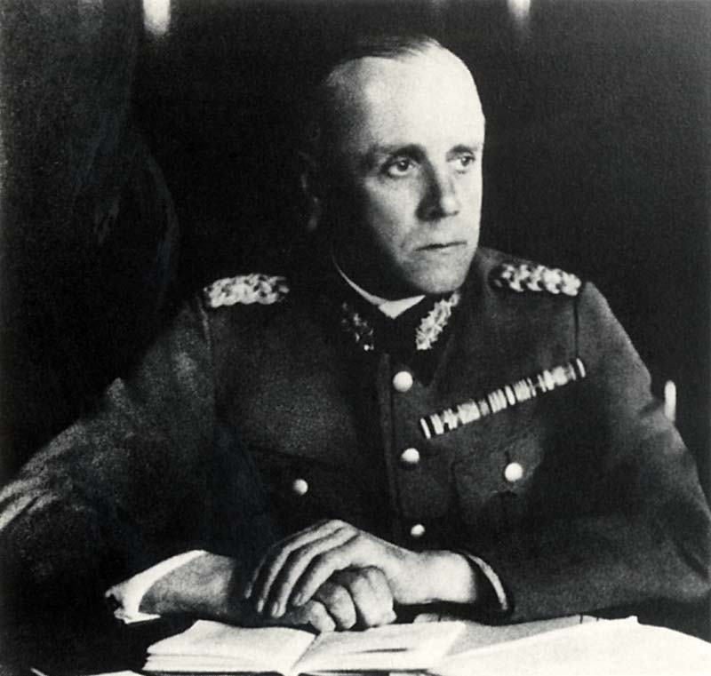
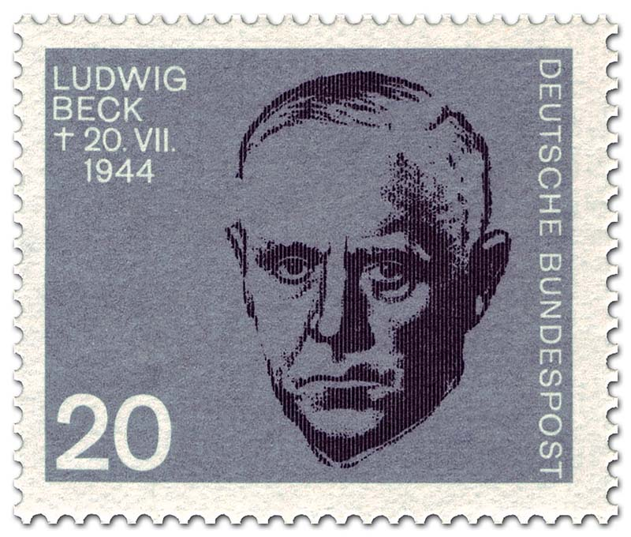
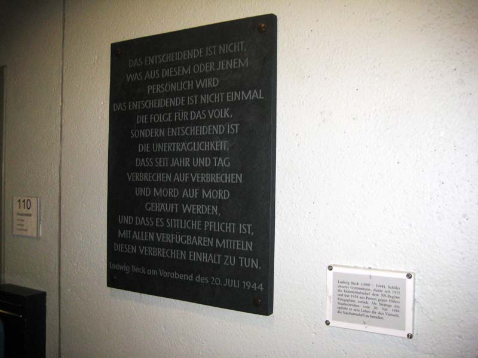

{{ bilder }}

**Ludwig Beck**

Der Sohn des auch kommunalpolitisch engagierten Eigentümers der
Biebricher Eisen- und Stahlgießerei Rheinhütte Prof. Dr. Ludwig Beck
schlug nach seinem Abitur am Humanistischen Gymnasium in Wiesbaden, der
heutigen Diltheyschule, die Offizierslaufbahn ein. Den Ausgang des
Ersten Weltkrieges, in dem er als Generalstabsoffizier an der Westfront
eingesetzt gewesen war, und die Novemberrevolution des Jahres 1918 hatte
Beck als nationale Schmach empfunden. Erst noch Anhänger der damals
durchaus nicht nur in bürgerlichen Kreisen weit verbreiteten
„Dolchstoßlegende“, nach welcher der Sieg des deutschen Heeres angeblich
durch die Antikriegsagitation der Sozialdemokratie und das sonstige
Vorgehen der Revolutionäre verhindert worden sei, revidierte er dieses
Fehlurteil schließlich.

Der trotzdem weiterhin überzeugte Monarchist diente während der von ihm
somit gewiss nicht geschätzten Weimarer Republik in verschiedenen
Truppen- und Stabsstellen und war dabei massiv an der geheimen
Aufrüstung beteiligt. Zum Generalleutnant aufgestiegen, wurde er im
Herbst 1933 zum Chef des Truppenamtes im Reichswehrministerium ernannt,
so bis 1935 die Tarnbezeichnung des Generalstabes des Heeres. Hitlers
„Drittem Reich“ gegenüber anfänglich noch positiv positioniert, sorgte
Beck zielstrebig für dessen weitere Aufrüstung. Früh verlangte er die
Wiedereinführung der Allgemeinen Wehrpflicht und die Remilitarisierung
des Rheinlandes, was beides von Hitler dann 1935/36 unter Bruch der
Verträge von Versailles und Locarno in die Tat umgesetzt wurde. Während
Beck den Aufstieg Deutschlands zur zentraleuropäischen Hegemonialmacht
ermöglichen wollte, waren dies für Hitler unabdingbare Voraussetzungen
zur Vorbereitung des von ihm angestrebten großen Expansionskrieges.

{: .bild .links}
Von Beck, inzwischen zum General der Artillerie befördert, sind
begrenzte, rasch durchgeführte Kriege in Mitteleuropa zur Durchsetzung
deutscher Interessen nie ausgeschlossen worden. Gleichwohl hatte ihn
Hitlers Ankündigung vor den höchsten militärischen Befehlshabern sowie
dem Reichsaußenminister vom 5. November 1937 immens bestürzt, demnächst,
d. h. bei noch nicht vollständig erfolgter Wiederaufrüstung zunächst die
Tschechoslowakei und Österreich zu annektieren, um später die Behebung
der vorgeblichen deutschen „Raumnot“ insgesamt ebenfalls auf dem „Weg
der Gewalt“ herbeizuführen. Obwohl ihn die Totalitätsansprüche und die
extreme Amoralität Hitlers und seiner Gefolgschaft bereits seit geraumer
Zeit abgestoßen hatten, führte erst der höchst riskante Kriegskurs des
Diktators bei Beck zu jenem, von mehreren Denkschriften markierten
Distanzierungsprozess, der ihn – freilich vergebens – den kollektiven
Rücktritt der Generalität zwecks Bewahrung des Friedens fordern ließ.
Jener Konflikt endete schließlich mit dem Entlassungsgesuch des
Generalstabschefs im Sommer 1938.

Zumindest informell stand der bei seinem Ausscheiden zum Generalobersten
beförderte Beck mit jenen militärischen und zivilen Regimegegnern in
Verbindung, die bereits im September 1938 einen ersten konkreten
Staatsstreichplan entwickelt hatten. Dieser war dann aber wegen der
durch das Münchner Abkommen zwischen Deutschland, Großbritannien,
Frankreich und Italien ermöglichten kampflosen Besetzung des
Sudetenlandes hinfällig geworden. In jedem Fall war der wegen der
Kirchenfeindlichkeit des Regimes, der Pogrome im November jenes Jahres
und mehr noch ob des ab September 1939 erfolgenden Völkermordes an den
Juden, aber auch wegen der kaum minder abscheulichen Kriegsführung in
Polen maßlos empörte Beck in die diversen künftigen Umsturzplanungen
federführend einbezogen. Ähnlich gilt dies für seinen schon 1937 aus
Protest gegen eine antijüdische Maßnahme des Regimes vom Amt des
Leipziger Oberbürgermeisters zurückgetretenen langjährigen konspirativen
Kooperationspartner, den einstmals deutschnationalen Monarchisten Dr.
Carl Goerdeler. Beide waren nicht nur Hauptakteure, sondern vielmehr
unangefochtene Anführer der diesbezüglichen zivil-militärischen
Opposition bürgerlicher Prägung.

{: .bild .links}
Daneben unterhielt Beck spätestens seit 1939 klandestine Beziehungen
auch mit Vertretern der demokratischen Linken, insbesondere mit dem
früheren hessischen Innenminister und sozialdemokratischen
Gewerkschaftsführer Wilhelm Leuschner. Schon bei ihrem ersten Treffen im
Herbst jenes Jahres wurde ihr von großem wechselseitigen Respekt
getragenes Vertrauensverhältnis begründet. Dieses sollte die stabile
Basis für die umsturzrelevante Kooperation von Regimegegnern aus dem
Militär, dem Bürgertum und aus der nichtkommunistischen Arbeiterbewegung
bilden, welche für die Freiheitserhebung vom 20. Juli 1944 konstitutiv
war.

Beck erstellte auch fortan noch Denkschriften außen- wie
innenpolitischen Charakters, manche davon gemeinsam mit Dr. Goerdeler.
Diese zielten auf Errichtung einer parlamentarischen Monarchie bzw. auf
die eines ständestaatlich-autoritären Staatswesens ab, was aber von
Leuschner und seinen Mitstreitern bestimmt nicht akzeptiert worden wäre,
wenigstens nicht auf Dauer. Auch an der Ausarbeitung bzw. der
Überarbeitung von Aufrufen an die Wehrmacht und an die Zivilbevölkerung
war Beck beteiligt. {: .bild .rechts}Mit Nachdruck bestand er darauf, dass am politischen
Charakter des geplanten Staatstreichs auch von den beteiligten Militärs
nicht gerüttelt wurde. Aus demselben Grund forderte er seit Herbst 1943
die Benennung sogenannter Politischer Beauftragter und Unterbeauftragter
für die einzelnen Wehrkreise. Diese sollten am Tag X umgehend
herangezogen werden und „bis auf weiteres die Aufgaben des
Verwaltungschefs“ übernehmen. Auch sollten sie den jeweiligen
„Wehrkreisbefehlshaber in allen politischen Fragen“ beraten und
überhaupt dort für die Durchsetzung der zivilen Ziele der zunächst noch
auf das Militär gestützten Umsturzregierung sorgen.

An ihre Spitze wäre Ludwig Beck selbst gerückt, dem danach auch das Amt
des Staatsoberhaupts des neuen, nun wieder nach rechtsstaatlichen
Grundsätzen aufgebauten Staatswesens übertragen worden wäre. Dieses
hätte aber erst nach dem Ende des Krieges und nach der Durchführung von
freien Wahlen begründet werden können. Wegen seiner Krebserkrankung wäre
Beck aber wahrscheinlich schon bald von Wilhelm Leuschner abgelöst
worden. Dieser sollte zunächst als Vizekanzler fungieren, während Carl
Goerdeler – aller Voraussicht nach ebenfalls nur übergangsweise – das
Amt des Reichskanzlers zugedacht gewesen war. Dass durch jenen Rechts-
und Verfassungsstaat eine wirkliche soziale Demokratie konstituiert
werden müsse, darin waren sich keineswegs nur die in die Verschwörung
involvierten, bereits seit gut einem Jahrzehnt miteinander verbündeten
christlichen, liberalen und sozialdemokratischen Widerständler einig.

{: .bild .links}
Nachdem der Aufstand binnen weniger Stunden in sich zusammengebrochen
war, wurde Beck am späten Abend des 20. Juli 1944 in der Befehlszentrale
der Verschwörung, dem Oberkommando des Heeres im Berliner Bendlerblock,
gefangen genommen und – als sein Versuch, sich selbst zu töten, zweimal
gescheitert war – gegen Mitternacht erschossen.

{: .bild .rechts  data-toggle="modal" data-target="#exampleModal"}
An ihn erinnern in Wiesbaden eine Gedenktafel am Wohnhaus der Eltern in
Biebrich, die Ludwig-Beck-Schule auf dem Gräselberg, eine Gedenktafel in
der Pausenhalle der Diltheyschule und biographische Hinweise auf deren
Homepage sowie der durch die hessische Landeshauptstadt verliehene
Ludwig-Beck-Preis für Zivilcourage.

Dr. Rolf Faber

  

    

      

        <button type="button" class="close" data-dismiss="modal" aria-label="Close">
          &times;
        </button>
      

      

        

          <ol class="carousel-indicators">
            <li data-target="#carouselExample" data-slide-to="0" class="active"></li>
            <li data-target="#carouselExample" data-slide-to="1"></li>
            <li data-target="#carouselExample" data-slide-to="2"></li>
            <li data-target="#carouselExample" data-slide-to="3"></li>
          </ol>
          

            

              
            

            

              
            

            

              
            

            

              
            

          

          <a class="carousel-control-prev" href="#carouselExample" role="button" data-slide="prev">
            
            Previous
          </a>
          <a class="carousel-control-next" href="#carouselExample" role="button" data-slide="next">
            
            Next
          </a>
        

      

      

        <button type="button" class="btn btn-secondary" data-dismiss="modal">Close</button>
      

    

  

